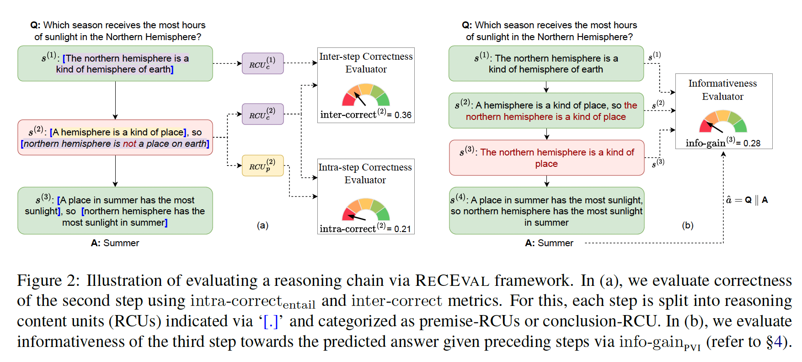

# ReCEval: Evaluating Reasoning Chains via Correctness and Informativeness
* Authors: [Archiki Prasad](https://archiki.github.io), [Swarnadeep Saha](https://swarnahub.github.io/), [Xiang Zhou](https://owenzx.github.io/), and [Mohit Bansal](https://www.cs.unc.edu/~mbansal/) (UNC Chapel Hill)
* [Paper](https://arxiv.org/abs/2304.10703)
* **Note:** This is preliminary version of our code. The complete code to run all experiments in the paper will be added shortly.



## Dependencies
This code is written using PyTorch and [HuggingFace's Transformer repo](https://github.com/huggingface/pytorch-transformers). Running ReCEval requires access to GPUs. The evaluation is quite light-weight, so one GPU should suffice. Please install [Entailment Bank](https://allenai.org/data/entailmentbank) and [GSM-8K](https://github.com/openai/grade-school-math) datasets separately. For using human judgements datasets for GSM-8K and running baselines please follow the setup procedure in [ROSCOE](https://github.com/facebookresearch/ParlAI/tree/main/projects/roscoe/) (preferably in a separate environment).

## Installation
The simplest way to run our code is to start with a fresh environment.
```
conda create -n ReCEval python=3.9
source activate ReCEval
pip install -r requirements.txt
```

## Running Evaluation
* `evaluate_receval.py` contains the implementation of metrics in ReCEval. 
* `train_*_pvi.py` scripts are used to train models for the PVI-based metrics.
* `perturb_EB.py` applies perturbations to the reasoning trees in [Entailment Bank](https://allenai.org/data/entailmentbank).
* `run_flan.py` is used to obtain chain of thought responses from the [GSM-8K](https://github.com/openai/grade-school-math) dataset.
* To compute metrics and evaluate, simply run `python evaluate_receval.py` (with default Entailment Bank). Default model and data directories can directly be changed within the script. These variables include:
  *   `inp_model_dir`: Model *g* for calculating PVI-based intra-step correctness
  *   `inp_model_dir`: Model *g'* for calculating PVI-based intra-step correctness
  *   `info_model_dir`: Model for calculating PVI-based information-gain
  *   `source_path`: Path containing reasoning chains to be scored or meta-evaluated

## Reference
Please cite our paper if you use our repository in your works:
```bibtex

@article{Prasad2023ReCEval,
  title         = {ReCEval: Evaluating Reasoning Chains via Correctness and Informativeness},
  author        = {Archiki Prasad and Swarnadeep Saha and Xiang Zhou and Mohit Bansal},
  year          = {2023},
  archivePrefix = {arXiv},
  primaryClass  = {cs.CL},
  eprint        = {2304.10703}
}
```
